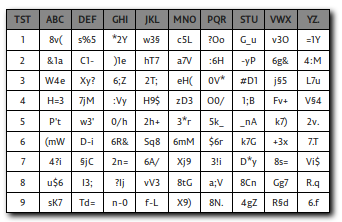
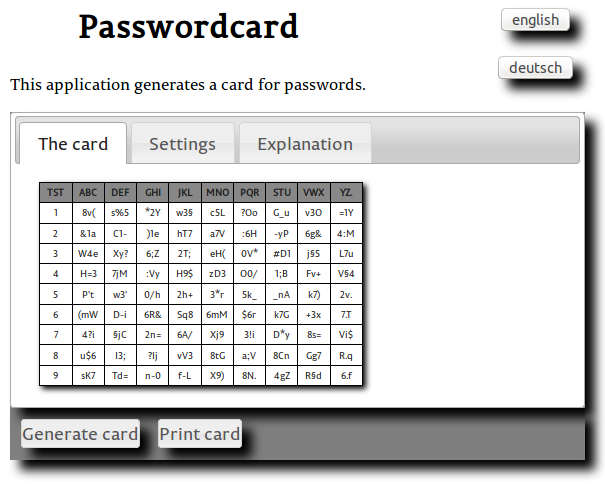
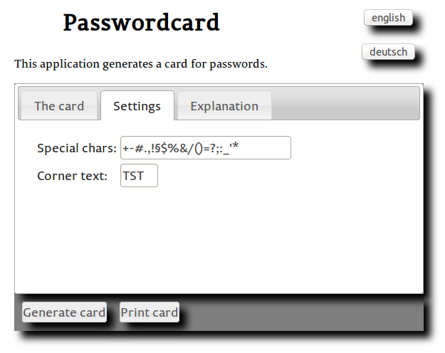
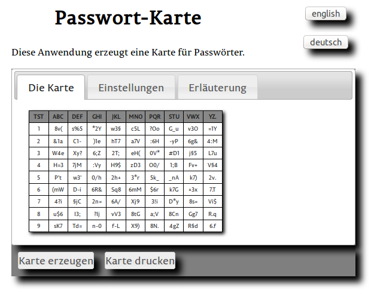
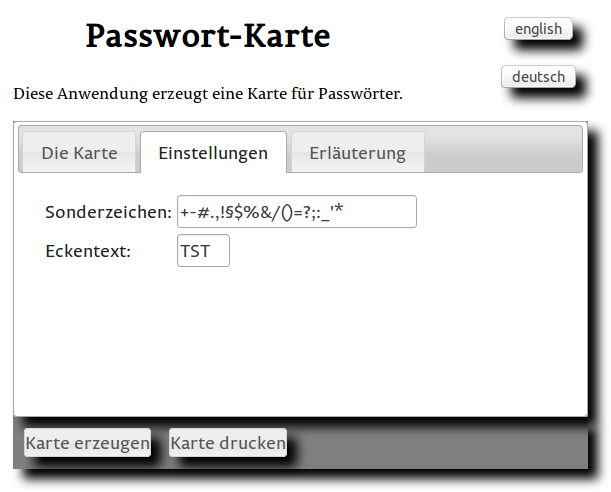

# Password card generator
 
## Inhalt/Contents

* [English](#english)
* [Deutsch](#deutsch)
* [License](#license) 

## English

This application is a JavaScript standalone application to generate password cards. You can put it on your own webserver or use it from your harddrive.

The cards print exactly in credit card size and can be used to generate passwords. The advantage: the passwords are strictly separated from your electronic devices.

The idea is from the german magazine *c't*, issue 18/2014, p. 92.

The generated cards look like this one:

Each triple contains one character out of three of the following classes:

* Upper case letters
* lower case letters
* numeral
* special chars

### How to use the card

Assume you have an account at *example.com*. You take the first four letters of the domain name ("exam") and lookup the three letter combinations in the first row of the matching columns, that is `s%5` for the "e", `v3O` for the "x", `8v(` for the "a" and finally `c5L` for the "m". Your first password for your account at *example.com* is `s%5v3O8v(c5L`.

Once you've to change your password you generate a new one using the second row.

### The entry screen

The entry screen starts with a card generated with default settings. 

You can generate a new one using the "Generate card" button. To get a credit card sized print, use the "Print card" button.

The "settings" tab allows you to change the way the cards are generated.

### The settings screen

This screen allows you to manipulate the way the cards are generated.

You can choose the short text in the upper left corner of the card to identify several cards, e.g. one for private use and another for business.

You can change the *special chars* used to generate the card entries. If you have an approbiate keyboard you would like to have e.g. umlauts (äöüß) in your password.

## Deutsch

Die Anwendung ist eine standalone JavaScript-Anwendung. Man kann sie auf einen eigenen Webserver bringen oder direkt von der Festplatte nutzen.

Die erzeugten Karten werden exakt in Kreditkartengröße ausgedruckt und können für die Erzeugung von Passwörtern verwendet werden. Der Vorteil: die Passwörter werden völlig unabhängig von irgendwelchen elektronischen Gerätschaften aufbewahrt.

Die Idee stammt aus dem deutschen Magazin *c't*, Ausgabe 18/2014, S. 92.

Die erzeugten Karten sehen so aus:

Jedes Triplett enthält ein Zeichen aus drei der folgenden Kategorien:

* Großbuchstaben
* Kleinbuchstaben
* Ziffern
* Sonderzeichen

### Wie man die Karte verwendet

Angenommen man hat einen Account bei *example.com*. Man nimmt die ersten vier Buchstaben des Domain-Namens ("exam") und sucht in der ersten Zeile die dreibuchstabigen Kombinationen aus den entsprechenden Spalten zusammen, also `s%5` für das "e", `v3O` für das "x", `8v(` für das "a" und schließlich `c5L` für das "m". Das Passwort für den account bei *example.com* ist dann `s%5v3O8v(c5L`.

Wenn man das Passwort ändern möchte verwendet man die zweite Reihe, um sich ein neues zu erzeugen.

### Einstiegsbild

Das Einstiegsbild zeigt eine aus den Anfangseinstellungen erzeugte Karte.

Mit dem Button "Karte erzeugen" erzeugt man eine neue, mit dem Button "Karte drucken" druckt man ein kreditkartengroßes Exemplar aus.

Mit dem Reiter "Einstellungen" kann man die generierte Karte beeinflussen:

### Einstellungsbild

Mit "Eckentext" ändert man den in der linken oberen Ecke der Karte angezeigten Text. Das kann man verwenden um z.B. eine Karte für den Privatgebrauch und eine andere für den Beruf zu erzeugen.

Unter "Sonderzeichen" stellt man die verwendeten Sonderzeichen ein. Wenn man eine passende Tastatur hat möchte man vielleicht Umlaute in seinen Passwörtern verwenden.

## License

Copyright (c) 2014, 2015 Peter Brockfeld. See the LICENSE.md file for license rights and limitations (MIT).